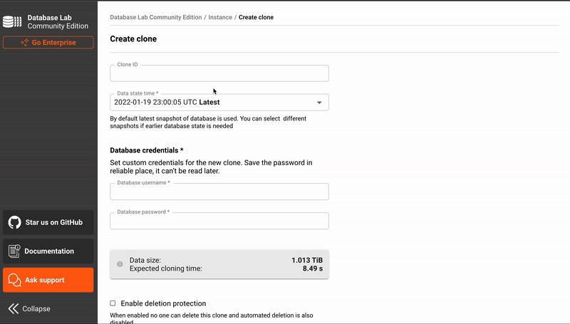

<p></p>

---

# Database Lab Engine (DLE)

<a href="https://postgres.ai"></a>

[](https://github.com/postgres-ai/database-lab-engine/releases/latest)

<a href="https://slack.postgres.ai"></a>

Database Lab Engine (DLE) is an open source technology that allows blazing-fast cloning of Postgres databases:

- Build dev/QA/staging environments based on full-size production-like databases.
- Provide temporary full-size database clones for SQL query analysis and optimization (see also: [SQL optimization chatbot Joe](https://gitlab.com/postgres-ai/joe)).
- Automatically test database changes in CI/CD pipelines to avoid incidents in production.

For example, cloning a 1 TiB PostgreSQL database can take less than 2 seconds and dozens of independent clones can run on a single machine without extra costs, supporting lots of development and testing activities.

<p></p>

## How it works
Thin cloning is fast because it is based on the [CoW (Copy-on-Write)](https://en.wikipedia.org/wiki/Copy-on-write#In_computer_storage). DLE supports two technologies to enable CoW and thin cloning: [ZFS](https://en.wikipedia.org/wiki/ZFS) (default) and [LVM](https://en.wikipedia.org/wiki/Logical_Volume_Manager_(Linux)).

With ZFS, Database Lab Engine periodically creates a new snapshot of the data directory, and maintains a set of snapshots, periodically deleting the old ones. When requesting a new clone, users choose which snapshot to use. For example, one can request to create two clones, one with a very fresh database state, and another corresponding to yesterday morning. In a few seconds, clones are created, and it immediately becomes possible to compare two database versions: data, SQL query plans, and so on.

Read more:
- [How it works](https://postgres.ai/products/how-it-works)
- [Database Migration Testing](https://postgres.ai/products/database-migration-testing)
- [SQL Optimization with Joe Bot](https://postgres.ai/products/joe)
- [Questions and answers](https://postgres.ai/docs/questions-and-answers)

## Where to start
- [Database Lab tutorial for any PostgreSQL database](https://postgres.ai/docs/tutorials/database-lab-tutorial)
- [Database Lab tutorial for Amazon RDS](https://postgres.ai/docs/tutorials/database-lab-tutorial-amazon-rds)
- [Terraform module template (AWS)](https://postgres.ai/docs/how-to-guides/administration/install-database-lab-with-terraform)

## Case studies
- Qiwi: [How Qiwi Controls the Data to Accelerate Development](https://postgres.ai/resources/case-studies/qiwi)
- GitLab: [How GitLab iterates on SQL performance optimization workflow to reduce downtime risks](https://postgres.ai/resources/case-studies/gitlab)

## Features
- Blazing-fast cloning of Postgres databases – a few seconds to create a new clone ready to accept connections and queries, regardless of the database size.
- The theoretical maximum number of snapshots and clones is 2<sup>64</sup> ([ZFS](https://en.wikipedia.org/wiki/ZFS), default).
- The theoretical maximum size of PostgreSQL data directory: 256 quadrillion zebibytes, or 2<sup>128</sup> bytes ([ZFS](https://en.wikipedia.org/wiki/ZFS), default).
- PostgreSQL major versions supported: 9.6–14.
- Two technologies supported to enable thin cloning ([CoW](https://en.wikipedia.org/wiki/Copy-on-write)): [ZFS](https://en.wikipedia.org/wiki/ZFS) and [LVM](https://en.wikipedia.org/wiki/Logical_Volume_Manager_(Linux)).
- All components are packaged in Docker containers.
- UI to make manual work more convenient.
- API and CLI to automate the work with DLE snapshots and clones.
- By default, PostgreSQL containers include many popular extensions ([docs](https://postgres.ai/docs/database-lab/supported-databases#extensions-included-by-default)).
- PostgreSQL containers can be customized ([docs](https://postgres.ai/docs/database-lab/supported-databases#how-to-add-more-extensions)).
- Source database can be located anywhere (self-managed Postgres, AWS RDS, GCP CloudSQL, Azure, Timescale Cloud, and so on) and does NOT require any adjustments. There is NO requirements to install ZFS or Docker to the source (production) databases.
- Initial data provisioning can be at both physical (pg_basebackup, backup / archiving tools such as WAL-G or pgBackRest), or logical (dump/restore directly from the source or from files stored at AWS S3) levels.
- For the logical mode, partial data retrieval supported (specific databases, specific tables).
- For the physical level, continuously updated state is supported ("sync container") making DLE a specialized version of standby Postgres.
- For the logical level, full periodical refresh is supported, automated and controlled by DLE. To avoid downtime, it is possible to use multiple disks containing different versions of database.
- Fast PITR to the points available in DLE snapshots.
- Unuzed clones are automatically deleted.
- "Deletion protection" flag can be used to block automatic or manual deletion of clones.
- Snapshot retention policies supported in DLE configuration.
- Peristent clones: clones survive DLE restarts (including full VM reboots).
- The "reset" command can be used to switch to a different version of data.
- DB Migration Checker component collects various artefacts useful for DB testing in CI ([docs](https://postgres.ai/docs/db-migration-checker)).
- SSH port forwarding for API and Postgres connections.
- Docker container config parameters can be specified in the DLE config.
- Resource usage quotas for clones: CPU, RAM (container quotas, supported by Docker)
- Postgres config parameters can be specified in the DLE config (separately for clones, the "sync" container, and the "promote" container).
- Monitoring: auth-free `/healthz` API endpoint, extended `/status` (requires auth), [Netdata module](https://gitlab.com/postgres-ai/netdata_for_dle).

## How to contribute
### Give the project a star
The easiest way to contribute is to give the project a GitHub/GitLab star:


### Mention that you use DLE
Please post a tweet mentioning [@Database_Lab](https://twitter.com/Database_Lab) or share the link to this repo in your favorite social network.

If you are actively using DLE at work, think where could you mention it. The best way of mentioning is using graphics with a link. Brand assets can be found in the `./assets` folder. Feel free to put them to your documents, slide decks, application and website interfaces to show that you use DLE.

HTML snippet for lighter backgrounds:
<p>
  
</p>

```html
<a href="http://databaselab.io">
  
</a>
```

Fro darker backgrounds:
<p style="background-color: #bbb">
  
</p>

```html
<a href="http://databaselab.io">
  
</a>
```

### Propose an idea or report a bug
Check out our [contributing guide](./CONTRIBUTING.md) for more details.

### Participate in development
Check out our [contributing guide](./CONTRIBUTING.md) for more details.

### Reference guides
- [DLE components](https://postgres.ai/docs/reference-guides/database-lab-engine-components)
- [DLE configuration reference](https://postgres.ai/docs/database-lab/config-reference)
- [DLE API reference](https://postgres.ai/swagger-ui/dblab/)
- [Client CLI reference](https://postgres.ai/docs/database-lab/cli-reference)

### How-to guides
- [How to install Database Lab with Terraform on AWS](https://postgres.ai/docs/how-to-guides/administration/install-database-lab-with-terraform)
- [How to install and initialize Database Lab CLI](https://postgres.ai/docs/guides/cli/cli-install-init)
- [How to manage DLE](https://postgres.ai/docs/how-to-guides/administration)
- [How to work with clones](https://postgres.ai/docs/how-to-guides/cloning)

More you can found in [the "How-to guides" section](https://postgres.ai/docs/how-to-guides) of the docs. 

### Miscellaneous
- [DLE Docker images](https://hub.docker.com/r/postgresai/dblab-server)
- [Extended Docker images for PostgreSQL (with plenty of extensions)](https://hub.docker.com/r/postgresai/extended-postgres)
- [SQL Optimization chatbot (Joe Bot)](https://postgres.ai/docs/joe-bot)
- [DB Migration Checker](https://postgres.ai/docs/db-migration-checker)

## License
DLE source code is licensed under the OSI-approved open source license GNU Affero General Public License version 3 (AGPLv3).

Reach out to the Postgres.ai team if you want a trial or commercial license that does not contain the GPL clauses: [Contact page](https://postgres.ai/contact).

## Community & Support
- ["Database Lab Engine Community Covenant Code of Conduct"](./CODE_OF_CONDUCT.md)
- Where to get help: [Contact page](https://postgres.ai/contact)
- [Community Slack](https://slack.postgres.ai)
- If you need to report a security issue, follow instructions in ["Database Lab Engine security guidelines"](./SECURITY.md).

[](./CODE_OF_CONDUCT.md)


<!-- 
## Translations
- ...
-->
